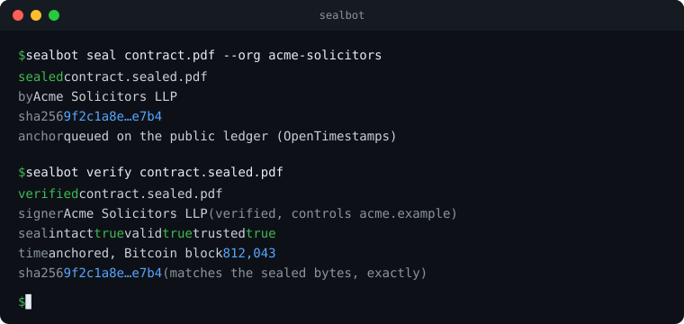
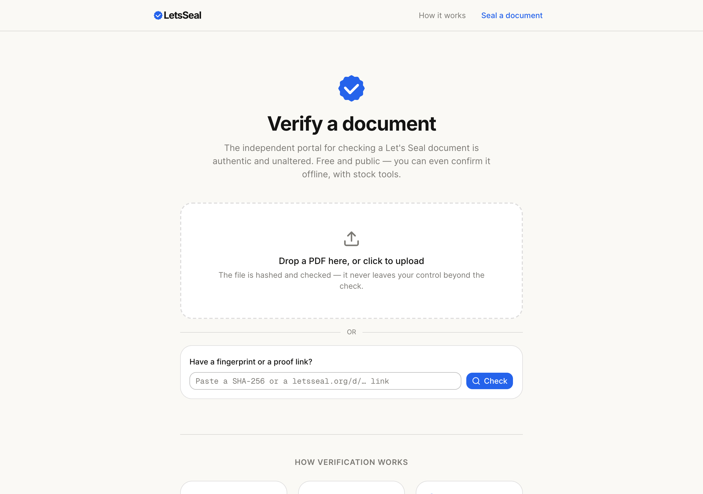
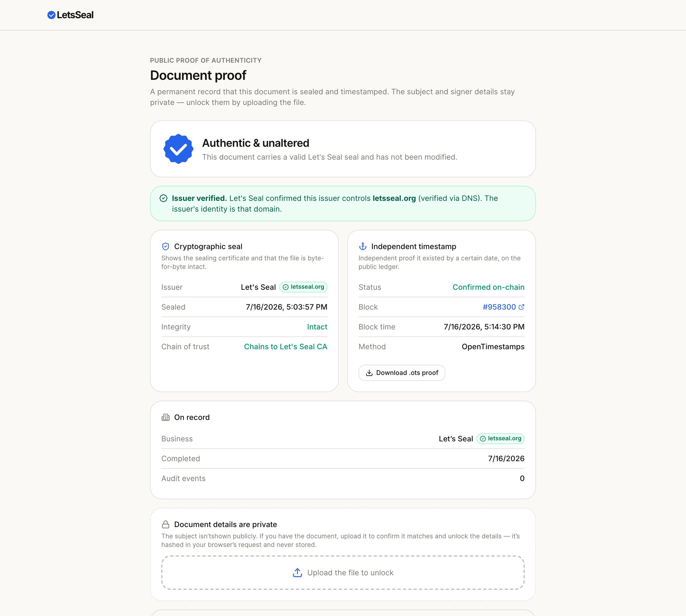
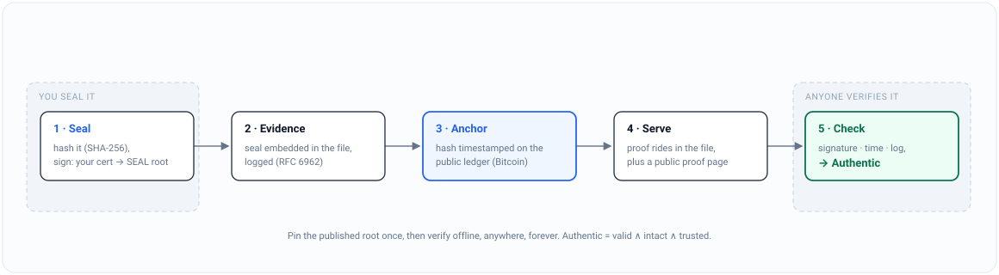
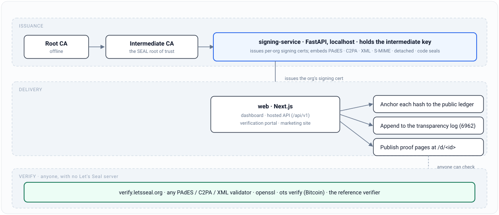

<div align="center">
  
  <h1>Let's Seal</h1>
  <p><strong>Seal anything.</strong></p>
  <p>The open standard for proving any file is real: unaltered, sealed by a known certificate, and in existence by a certain date.</p>

  <p>
    <a href="LICENSE"></a>
    <a href="SPEC.md"></a>
    <a href="https://www.npmjs.com/package/sealbot"></a>
    <a href="https://github.com/letsseal/letsseal/releases"></a>
    <a href="https://letsseal.org"></a>
  </p>

  <p>
    <a href="https://letsseal.org">Website</a> ·
    <a href="SPEC.md">The SEAL standard</a> ·
    <a href="https://app.letsseal.org">Free web app</a> ·
    <a href="#quickstart">Quickstart</a> ·
    <a href="#what-it-seals">What it seals</a> ·
    <a href="#how-a-seal-is-made-and-checked">How it works</a> ·
    <a href="#use-cases">Use cases</a> ·
    <a href="#for-developers">Developers</a> ·
    <a href="#self-host">Self-host</a> ·
    <a href="https://verify.letsseal.org">Verify a document</a>
  </p>
</div>

---

**SEAL is the open standard for proving any file is real.** One sealed artifact, one way to check it, verifiable by anyone, forever. Seal with any conforming tool, and anyone can verify it with any other.

Let's Seal created that standard, **SEAL**, Sealed Evidence Anchored to a Ledger, and runs the free network and reference implementation that issues and verifies it. The standard is the backbone. Everything in this repository is built on it, and given away.

It is the Let's Encrypt of document proof. Let's Encrypt made paid TLS certificates obsolete. Let's Seal does the same for paid document seals, and like Let's Encrypt it is free, open, and run as a public-benefit project of a foundation, not a startup.

**Authenticity is infrastructure. It shouldn't be for rent.**

## Use it, free

Three ways to seal, all free:

- **The hosted web app**, [app.letsseal.org](https://app.letsseal.org). Free for anyone, in the browser, nothing to install. Seal a file, send documents out for signature (remote, in person, or with no email at all), and issue branded certificates and credentials.
- **The command line and API.** `sealbot` for the terminal, plus a REST API and SDKs to build sealing into your own systems.
- **Self-hosted.** Run the whole engine yourself, under your own certificate authority.

Verifying is always free and never needs an account, at [verify.letsseal.org](https://verify.letsseal.org) or offline on your own machine.

- **Free forever.** No per-document fees, no paid seal.
- **Open source (Apache-2.0).** The engine, the SDKs, and the standard itself.

## What a seal proves

A SEAL proof establishes three things cryptographically, and states its boundary plainly:

- **Unaltered.** The file has not changed by a single byte since it was sealed. Change one byte and the signature breaks.
- **Time.** It existed by a certain date, anchored to Bitcoin through [OpenTimestamps](https://opentimestamps.org), with no trust in us.
- **Issuer.** It was sealed by a specific certificate. Where an organisation has proven control of a domain, the seal carries that domain as a machine-checkable identity.

Every seal is also written to a public, append only transparency log (RFC 6962) with a Bitcoin anchored root, so the record of what was sealed is itself tamper evident and anyone can audit it.

That is the whole guarantee, complete and permanent. A seal proves integrity, time, and the issuing certificate. It is not notarisation, and it does not assert a person's real world identity. The identity feature binds an email that a provider verified at seal time, and the honest term for it is a provider verified email, which is exactly what it delivers.

## What it seals

One standard, every kind of file, each in its own native format so any standard validator can check it. No bespoke tooling for the reader, and no dependency on Let's Seal to verify.

| File | Seal form | How it verifies |
|---|---|---|
| **PDF** | PAdES / X.509 signature embedded in the file | Any standard PAdES validator, or the reference verifier here |
| **Image, video, audio** | C2PA (Content Credentials) manifest embedded in the media | Any C2PA reader |
| **XML** | Enveloped W3C XML-DSig signature | Any XML-DSig validator |
| **Email** | S/MIME `multipart/signed` (RFC 8551) | `openssl smime -verify` |
| **Any other file** | Detached CAdES / CMS `.sig` over the file's SHA-256 | `openssl cms -verify`; the file's bytes never leave your machine |
| **Software artifact, container image** | Signature plus in-toto / DSSE attestation (SBOM, SLSA provenance) | The standard open artifact-signing tools your pipeline already runs |

The seal is native to each format, so a sealed PDF is still a normal PDF that opens anywhere, a sealed image still shows everywhere, and a signed artifact still installs as usual. The proof rides along inside.

## See it in action

Seal and verify from the command line:

<p align="center"></p>

The free public verification portal, [verify.letsseal.org](https://verify.letsseal.org):

<p align="center"></p>

A public proof page: the plain-English verdict anyone can open, with the evidence behind it. Subject and signer details stay private until you upload the file:

<p align="center"></p>

The hosted app at [app.letsseal.org](https://app.letsseal.org) does the rest: seal files, send documents out for signature (remote, in person, or with no email at all), and issue branded certificates and credentials.

## Quickstart

Verify any sealed document, free and in the open, at **[verify.letsseal.org](https://verify.letsseal.org)**, or run the reference verifier yourself:

```bash
python spec/verify.py sealed.pdf sealed.pdf.ots
```

Seal a file through the hosted API with an organisation key:

```bash
curl -X POST https://app.letsseal.org/api/v1/seal \
  -H "Authorization: Bearer $LETSSEAL_KEY" \
  -F file=@contract.pdf
```

Or from the command line:

```bash
sealbot seal contract.pdf          # seal a PDF or any file
sealbot verify contract.sealed.pdf # verify a seal, offline
```

SDKs for Python and TypeScript, plus the OpenAPI schema, live in [`sdk/`](sdk/).

## What a proof looks like

Open a sealed file's proof page, or run the verifier, and you get a plain verdict backed by evidence anyone can reproduce:

```
Authentic and unaltered

  Document      contract.pdf
  SHA-256       9f2c1a…e7b4     (matches the sealed bytes, exactly)
  Issuer        Acme Solicitors LLP
                Issuer verified, controls acme.example  (dNSName in the cert)
  Sealed        2026-07-14 11:42 UTC
  Time anchor   Bitcoin block #812,043   (via OpenTimestamps)
  Transparency  Entry #48,120 in the public log, inclusion proof checks out

Verdict rule: Authentic = valid and intact and trusted.
A valid signature that does not chain to the published root is
reported as unrecognised, never as authentic.
```

The verdict is deliberately strict. A cryptographically valid signature from a certificate that does not chain to the pinned root is a forgery vector, and it is reported as unrecognised, never as a pass.

## How a seal is made and checked

The life of a seal: made once, evidenced and anchored to the public ledger, served back, and checkable by anyone, forever.

<p align="center"></p>

## Verify it yourself, free

Two checks, both independent of us. A seal carries everything needed to check it, so pin the published root once and then verify offline, anywhere, forever.

- **Root fingerprint (SHA-256):** `02:68:6D:EE:20:67:31:C4:59:C1:7A:9F:58:36:7B:0B:0B:BA:5D:24:C6:85:D8:6D:1F:74:49:86:2D:C0:FE:BE`, subject `CN=Let's Seal Root CA, O=Let's Seal, C=GB`. Download it at [letsseal.org/api/root-ca](https://letsseal.org/api/root-ca).
- **PDF:** any standard PAdES validator with the root pinned, or `python spec/verify.py sealed.pdf sealed.pdf.ots`.
- **Email and detached:** `openssl smime -verify -in message.eml -CAfile letsseal-root.crt` · `openssl cms -verify -inform DER -in file.sig -content file -binary -CAfile letsseal-root.crt`.
- **Software and SBOM:** the standard open artifact-signing tools verify the signature and attestation against the published root, reproducible on any machine.
- **Time:** `ots verify sealed.pdf.ots` against Bitcoin.
- **Transparency log:** fetch an inclusion proof at `/api/log/proof?sha256=<hex>` and check it against the signed tree head at `/api/log/sth` (RFC 6962). Consistency proofs at `/api/log/consistency` prove the log is append only.

## The public transparency log

Every seal is written to an append only Merkle log (RFC 6962), the same structure browsers rely on for Certificate Transparency. The log's root is signed and itself anchored to Bitcoin, so:

- anyone can prove a given seal is included in the log (an inclusion proof),
- anyone can prove the log has never been rewritten (a consistency proof),
- and the whole thing can be audited without trusting the operator.

It is the impersonation audit trail: if a certificate ever sealed something under a name it shouldn't have, the evidence is public and permanent.

## Issuer identity

A seal always proves which certificate signed it. On top of that, an organisation can prove control of a domain (DNS record or a message to a controller address), and that domain is then bound into the signing certificate itself as a `dNSName`, so an off-platform verifier reads the identity straight from the certificate.

- Organisations that have not verified a domain are shown as self asserted, never as verified.
- A verified issuer's badge is the domain it controls, which is globally unique and cannot collide.
- Abuse can be reported publicly, and an impersonating issuer can be suspended, which stops its keys and drops its verified badge.

This is domain control as identity, the same model the web took for TLS. It proves who controls the seal, not a person's legal identity, and it says so plainly.

## The SEAL standard

**Open to verify. Open to implement. Impossible to lock up.**

SEAL is a published specification anyone can build on, see [SPEC.md](SPEC.md) and [letsseal.org/standard](https://letsseal.org/standard). The goal is one interoperable way to seal and verify any file, not a product to lock into. A SEAL proof is integrity, time, transparency, and optional verified-email attribution in a single self-contained artifact.

The signing service, the SDKs, and the reference verifier in this repository are the reference implementation. Anyone else is free to write their own, and a proof made by one implementation verifies under any other.

## Use cases

The standard fits any file and any sector. Worked guides for the common ones, each with step-by-step instructions and live proofs:

- **Documents and law:** [Law & legal](https://letsseal.org/use-cases/law) · [Property & conveyancing](https://letsseal.org/use-cases/property-conveyancing) · [Compliance & audit](https://letsseal.org/use-cases/compliance) · [HR & corporate](https://letsseal.org/use-cases/hr-corporate) · [Government & public sector](https://letsseal.org/use-cases/government-public-sector)
- **Finance and professional services:** [Banking & lending](https://letsseal.org/use-cases/banking-lending) · [Insurance](https://letsseal.org/use-cases/insurance) · [Accounting & audit](https://letsseal.org/use-cases/accounting-audit) · [Investment & asset management](https://letsseal.org/use-cases/investment-asset-management) · [Surveying & property reports](https://letsseal.org/use-cases/surveying-property-reports)
- **Software and supply chain:** [Software supply chain](https://letsseal.org/use-cases/software-supply-chain) · [Procurement & supply chain](https://letsseal.org/use-cases/procurement-supply-chain) · [Manufacturing & trade](https://letsseal.org/use-cases/manufacturing-trade)
- **Regulated and specialist:** [Healthcare](https://letsseal.org/use-cases/healthcare) · [Pharma & life sciences](https://letsseal.org/use-cases/pharma-life-sciences) · [Construction & engineering](https://letsseal.org/use-cases/construction-engineering) · [Intellectual property](https://letsseal.org/use-cases/intellectual-property) · [Education & credentials](https://letsseal.org/use-cases/education-credentials)
- **Media and individuals:** [Media, journalism & creative](https://letsseal.org/use-cases/media-journalism) · [Individuals & freelancers](https://letsseal.org/use-cases/individuals-freelancers)

See them all at [letsseal.org/use-cases](https://letsseal.org/use-cases).

## Architecture

<p align="center"></p>

The engine is fully self hostable and carries no hosted only code paths. A single-user install runs the identical code the hosted service runs.

## Self-host

Run the whole thing yourself, under your own certificate authority.

```bash
git clone https://github.com/letsseal/letsseal.git && cd letsseal

# 1. Certificate authority (see ca/)
./ca/setup-ca.sh init

# 2. Signing service (holds the intermediate key; bind to localhost)
cd signing-service && python -m venv .venv && . .venv/bin/activate
pip install -r requirements.txt && uvicorn main:app --port 8081

# 3. Web app: dashboard, hosted API, verification portal, site
cd ../web && npm install && cp .env.example .env   # fill in the values
npx prisma migrate deploy && npm run dev            # http://localhost:3000
```

You can swap in a paid AATL or eIDAS `.p12` later with zero code changes, if you want a reader's automatic green check for verifiers outside your own portal. The cryptographic guarantee is identical either way. Your verification portal is the trust anchor.

## For developers

**REST API** (hosted or self-hosted), authenticated with an organisation API key:

```
POST /api/v1/seal            seal a PDF (PAdES)
POST /api/v1/seal/c2pa       seal an image, video, or audio file (C2PA)
POST /api/v1/seal/xml        seal XML (XML-DSig)
POST /api/v1/seal/smime      seal an email message (S/MIME)
POST /api/v1/seal/detached   seal any file by digest (detached CAdES)
POST /api/v1/seal/blob       seal a software artifact
POST /api/v1/seal/identity   seal with a provider-verified email
POST /api/v1/attest          attach an SBOM / SLSA attestation
POST /api/v1/anchor          anchor a hash to Bitcoin
POST /api/v1/verify          verify a seal  (public, no key)
GET  /api/v1/whoami          check a key's organisation
```

Digest-only endpoints (`/seal/detached`, `/seal/blob`) never receive the file's bytes, only its SHA-256.

**CLI:** `sealbot seal`, `sealbot verify`, `sealbot issue`, `sealbot anchor`, `sealbot watch`. Install with `npm i -g sealbot` (or run `npx sealbot`); a self-contained Rust build lives in `cli-rs/`.

**SDKs:** hand-written clients for Python (`sdk/python`) and TypeScript (`sdk/ts`), plus the OpenAPI schema (`sdk/openapi.json`). Generate a client for any other language with `sdk/generate.sh`.

**CI:** seal build artifacts in a pipeline with the GitHub Action in `ci/`.

## Repository layout

| Path | What it is |
|---|---|
| `ca/` | Certificate authority as code (root and intermediate issuance) |
| `signing-service/` | FastAPI signing service (holds the intermediate key) |
| `web/` | Next.js app: dashboard, hosted API, verification portal, site |
| `spec/` | The SEAL specification and reference verifier |
| `sdk/` | Python and TypeScript SDKs, the OpenAPI schema, and `generate.sh` |
| `cli/`, `cli-rs/` | The `sealbot` command line tool (Node and Rust) |
| `ci/` | A GitHub Action for sealing artifacts in CI |

## Mission

Authenticity is infrastructure. It shouldn't be for rent. Proving a file is real is a public good, like a padlock in a browser bar, and it should be free, open, and owned by everyone who relies on it. Let's Seal is run as a public-benefit project of a foundation, not a startup, so the standard can never be pulled back behind a paywall.

## Licence

Apache-2.0, see [LICENSE](LICENSE) and [NOTICE](NOTICE). The SEAL specification is free to implement.

Created and maintained by [**nsokin**](https://github.com/nsokin). Let's Seal is a project of [Experimental Open Works](https://xowx.org).
